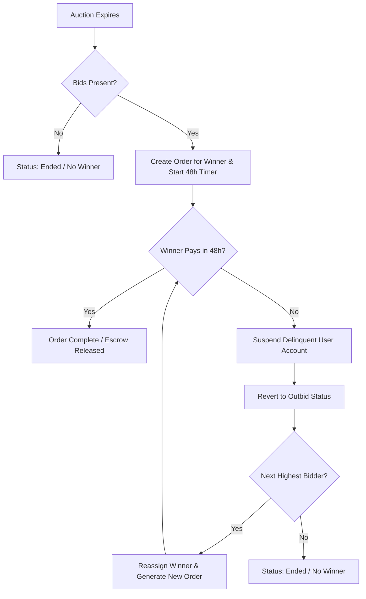

# 🎯 IntelliBid — AI-Powered Real-Time Auction Platform

> A production-grade, highly-available live bidding marketplace featuring dynamic real-time synchronization, intelligent user behavioral profiling with exponential interest decay, LLM-based cohort personalization, and delinquent order cascade resolution.

IntelliBid is built on a modern Node.js monorepo architecture featuring a **Next.js 16 (App Router)** client and an **Express.js API** backend, connected via **Socket.io** for real-time bid propagation and synchronized client-side state.

---

## ⚡ Core Technical Highlights (Why This Project Stands Out)

This platform isn't just a simple CRUD application. It incorporates advanced algorithms, real-time data streaming, state engines, and artificial intelligence to deliver a production-grade marketplace experience.

### 1. Mathematical User Behavior Profiling (Exponential Interest Decay)
Instead of static category filters, IntelliBid builds dynamic interest profiles for users based on their active session events (clicks, bids, searches). 
- **Recency Weighted Decay:** User interests decay over time to prioritize fresh interactions. Each event weight decays daily according to:
  $$\text{Decayed Weight} = \text{Event Weight} \times (0.95)^{\Delta t}$$
  where $\Delta t$ is the days elapsed since the interaction.
- **Dynamic Profile Reconstruction:** A scheduled cron job reconstructs category weights, tag vectors, and target price ranges (calculating min/max boundaries and running averages) to continuously shape the user's recommendations.

### 2. High-Performance Real-Time Bidding & Synced State
Live auctions require sub-second synchronization.
- **Dual-Layer socket.io Channels:** Users join both private channels (`user:<userId>`) for individual security alerts/outbid notifications and public channel rooms (`auction:<auctionId>`) for instant bid broadcasts.
- **State Hydration:** Client-side **Zustand stores** listen to socket events, instantly updating prices, bid tallies, and timelines on cards without forcing page refreshes.

### 3. Delinquency-Tolerant Escrow & Bid Cascade Resolution
Most marketplaces break when the winning bidder fails to pay. IntelliBid implements a state-machine resolution job:
1. **Auction Closure:** When an auction expires, an order is generated with a strict 48-hour payment deadline.
2. **Default Cascade:** If the winner defaults, the scheduler suspends the delinquent user, cancels the old order, reverts their bid, and checks the database for the *next highest valid bidder*.
3. **Cascaded Order Allocation:** The second-highest bidder is promoted, a new order is issued, and a new payment window begins. This process repeats automatically.



### 4. LLM-Based cohort Personalization
IntelliBid integrates Google's **Gemini-2.5-flash** (with automatic fallback to **Gemini-2.0-flash-lite**) using structured JSON outputs to generate hyper-persuasive marketing hooks for each product:
- Reads the current user's computed interest vectors and price comfort zones.
- Correlates them with active auction item metadata.
- Automatically generates user-specific hooks (e.g., *"Because you love Vintage Guitars and typically bid around $400, this 1974 Gibson is within your sweet spot."*).

---

## 🏗️ Architecture & Monorepo Structure

The project is configured as an **npm Workspaces monorepo**, ensuring clean dependency management, shared utilities, and separate build environments for client and server.

```
intellibid-fyp/
├── client/              # Next.js 16 Frontend App
│   ├── app/             # Role-based route groups: (auth), (buyer), (seller), (admin)
│   ├── components/      # UI components (Neo-Brutalism styling, Framer Motion)
│   ├── hooks/           # Custom client state hooks (e.g., useBehaviorTracker)
│   ├── store/           # Zustand global state (bids, chat, watchlist, feed)
│   └── lib/             # API client & Socket.io client configs
├── server/              # Express.js REST & WS Backend API
│   ├── src/
│   │   ├── config/      # DB connections, Cloudinary, Sockets, and Cron jobs
│   │   ├── middleware/  # Rate limiting, Auth authentication, Role validators
│   │   ├── models/      # Mongoose schemas (User, Auction, Bid, Order, Event)
│   │   └── modules/     # Domain-driven backend features (feed, payment, messages)
├── shared/              # Common constants, role scopes, and validation schemas
└── package.json         # Root workspace configurations
```

---

## 🛠️ Technology Stack

| Layer | Technology | Key Features |
| :--- | :--- | :--- |
| **Frontend** | Next.js 16 (React 19) | App Router, Layout Groups, Dynamic SSR/CSR Hybrid Routing |
| **Styling** | Tailwind CSS 4 + PostCSS | Custom OKLCH color palettes, Neo-Brutalism aesthetics |
| **Animations** | Framer Motion | Smooth state transitions, magnetic UI, custom micro-interactions |
| **State** | Zustand | Transient updates, decoupled context, persistent store slices |
| **Backend** | Node.js + Express.js | Modular, domain-driven architecture, structured middleware |
| **Database** | MongoDB + Mongoose | Transactional integrity, indexing for auction search, schemas |
| **Real-time** | Socket.io | Bi-directional communication, authenticated handshake |
| **Auth** | JWT + Google OAuth | Cookie-based security, OAuth2 flow, middleware checks |
| **Payments** | Stripe API | Secure checkout session API, escrow hold simulation |
| **AI Engine** | Gemini API | Structured Schema JSON prompt validation, fallback capabilities |

---

## 🧹 Repository Hygiene & Optimizations

This repository has been optimized for clean version control by removing redundant dependencies, metadata, and local development configurations:
1. **Removed Database Binaries from Git:** Untracked WiredTiger local MongoDB folders (`mongodb_data/`) which were committed by accident. Staged their removal from git index and updated the root `.gitignore` to protect future clones.
2. **Removed Build Cache Leaks:** Cleaned root-level `.next` folders which were generated during global CLI operations, keeping build folders correctly scoped to `client/.next`.
3. **Removed Stale Files:** Removed archive logs and zipped configurations (such as `client/eslint.config.zip`) to keep clone sizes minimal.

---

## 🚀 Production Deployment Blueprint

IntelliBid can be deployed using a split-hosting strategy (Vercel + Railway/Render) or a fully self-hosted Dockerized VPS.

### Option A: Distributed Managed Hosting (Recommended)

#### 1. Frontend (Next.js Client) -> Vercel
Vercel handles Next.js App Router caching, Server Actions, and SSR out-of-the-box.
- **Root Directory:** Set to `client` during import.
- **Build Command:** `next build`
- **Output Directory:** `.next`
- **Environment Variables:**
  ```env
  NEXT_PUBLIC_API_URL=https://api.yourdomain.com
  NEXT_PUBLIC_SOCKET_URL=https://api.yourdomain.com
  ```

#### 2. Backend (Express API & WebSockets) -> Render or Railway
Since the backend utilizes WebSockets (`socket.io`) and a scheduler (`node-cron`), a serverless deployment will NOT work. You must deploy to a persistent container service.
- **Root Directory:** Set to `server`.
- **Build Command:** `npm install`
- **Start Command:** `node src/server.js`
- **Important Config:** Enable **Sticky Sessions** (if deploying behind a load balancer) or scale horizontally by adding a Redis adapter to the `socket.io` server configurations.
- **Environment Variables:**
  ```env
  PORT=5000
  MONGO_URI=mongodb+srv://...
  JWT_SECRET=your_jwt_secret_key
  CLIENT_URL=https://yourdomain.com
  GEMINI_API_KEY=your_gemini_key
  STRIPE_SECRET_KEY=sk_test_...
  CLOUDINARY_CLOUD_NAME=...
  CLOUDINARY_API_KEY=...
  CLOUDINARY_API_SECRET=...
  ```

---

### Option B: Self-Hosted Docker Compose (VPS)

For maximum cost efficiency and horizontal scaling, deploy the entire stack to a single Virtual Private Server (VPS) like DigitalOcean or Hetzner.

Create a `docker-compose.yml` in the root:

```yaml
version: '3.8'

services:
  database:
    image: mongo:6.0
    container_name: intellibid-db
    restart: always
    volumes:
      - mongo_data:/data/db
    ports:
      - "27017:27017"

  backend:
    build:
      context: .
      dockerfile: ./server/Dockerfile
    container_name: intellibid-api
    restart: always
    environment:
      - PORT=5000
      - MONGO_URI=mongodb://database:27017/intellibid
      - CLIENT_URL=https://intellibid.yourdomain.com
    depends_on:
      - database
    ports:
      - "5000:5000"

  frontend:
    build:
      context: .
      dockerfile: ./client/Dockerfile
      args:
        - NEXT_PUBLIC_API_URL=https://api.intellibid.yourdomain.com
        - NEXT_PUBLIC_SOCKET_URL=https://api.intellibid.yourdomain.com
    container_name: intellibid-ui
    restart: always
    ports:
      - "3000:3000"
    depends_on:
      - backend

volumes:
  mongo_data:
```

*Note: Configure your reverse proxy (Nginx/Caddy) to forward HTTP requests, upgrade WebSocket protocols, and manage SSL certificates.*

---

## 💻 Local Quickstart

### Prerequisites
- Node.js (v18+)
- MongoDB running locally or a cloud URI

### Installation
1. Clone the repository:
   ```bash
   git clone https://github.com/your-username/intellibid-fyp.git
   cd intellibid-fyp
   ```
2. Install workspace dependencies from the root directory:
   ```bash
   npm install
   ```
3. Set up environment variables:
   - Create `server/.env` matching the schema in `server/.env.example`.
   - Create `client/.env.local` to define environment variables for the frontend.

### Running Workspace Scripts
You can boot parts of the monorepo individually or together:
- **Run Client (Next.js):** `npm run dev:client`
- **Run Server (Express):** `npm run dev:server`
- **Run Both Simultaneously:** `npm run dev`